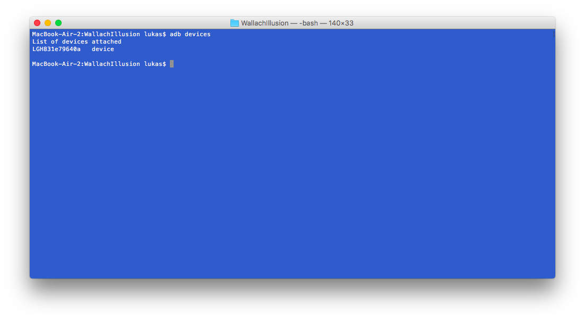
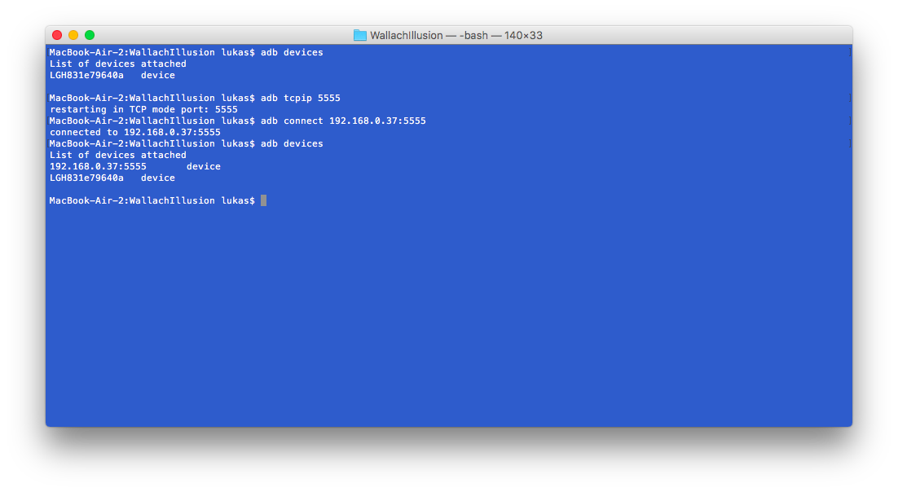

# Wallach Illusion Google Cardboard App

This repository contains a Google Cardboard App for testing the Wallach Auditory Illusion. 

## What is the Wallach Illusion?

The Wallach Illusion is an Auditory Illusion discovered by Hans Wallach in [1940](http://psycnet.apa.org/journals/xge/27/4/339/). It occurs when a sound source orbits a listeners head at twice the speed the listener is turning their head. Due to front/back confusion, the sound appears to be coming from a stationary source. Using recent advances in VR Technology, we have implemented an android app for use with [Google Cardboard](https://vr.google.com/cardboard/), that demonstrates this illusion. 

## Where Can I Get this App?

The first and easiest option is to download the app from the Google Play Store, [here](https://play.google.com/store/apps/details?id=com.tatalab.wallachillusion). 

The other option is to clone this repo, and run the project from Android Studio. 

## How to Use the App

The user wears a pair of headphones that are plugged into an android phone running the app. The phone is then placed in a VR Headset and worn. The user is shown 3 different cubes:

- A red cube that remains stationary
- A blue cube that moves with the users head
- A green cube that moves twice as fast as the users head


Each trial lasts 20 seconds. The user is then presented with the three cubes in a random order, and selects the cube that appeared to produce the sound. Selections are made by looking at the cube to be selected for 1.5 seconds. The cube is highlighted in yellow when the user is looking at it, as shown below: 


## How to Collect Data From the App

To collect data from the app wirelessly, first make sure you have the android developer tools installed. Then, make sure USB debugging is enabled on the phone, and connect it to the computer with a USB cable. In a terminal, type 

```
adb devices
```
and make sure the device is shown:

Then type

```
adb tcpip 5555
```
to enable wireless debugging on the device. Now type:

```
adb connect <device-ip>:5555
```
to connect wirelessly. Now you can disconnect the usb cable. eg:


Then, to log data from the device, use adb logcat. For example, you can log the users head movements to a file by running

```
adb logcat System.out:I *:S | grep head-position > head-position.txt
```

or the menu selections the user makes

```
adb logcat System.out:I *:S | grep menu-selection > menu-selection.txt
```

## References

Wallach, Hans. "The role of head movements and vestibular and visual cues in sound localization." Journal of Experimental Psychology 27.4 (1940): 339.

Brimijoin, W. Owen, and Michael A. Akeroyd. "The role of head movements and signal spectrum in an auditory front/back illusion." i-Perception 3.3 (2012): 179-182.

